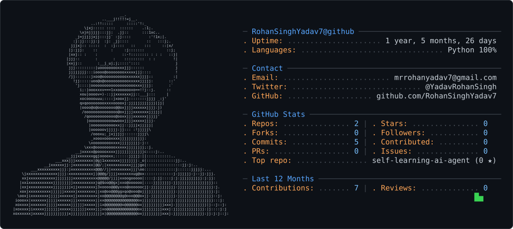

<picture>
  <source media="(prefers-color-scheme: dark)" srcset="dark_mode.svg" />
  <source media="(prefers-color-scheme: light)" srcset="light_mode.svg" />
  
</picture>

## 👨‍💻 About Me

AI Engineer in the making 🤖  
Python • AI/ML • GenAI • DSA  
Building real-world AI applications 🚀

## 🛠️ Tech Stack

- Python
- JavaScript
- React.js
- Node.js
- Express.js
- MongoDB
- SQL
- HTML
- CSS
- Git & GitHub

## 🚀 Projects

- 🤖 Self-Learning AI Agent
- 📄 AI Resume Builder
- 💬 AI Chatbot
- 🍔 Food Munch — Responsive Food Ordering UI
- 🗳️ College Voting System
- 📚 Library Management System
- 🛒 E-Commerce Application

## 🎯 Currently Learning

- Machine Learning
- Generative AI
- LLM Applications
- MLOps
- Data Structures & Algorithms

## 🤝 Connect With Me

- 💼 LinkedIn
- 📧 Email
- 🐙 GitHub
